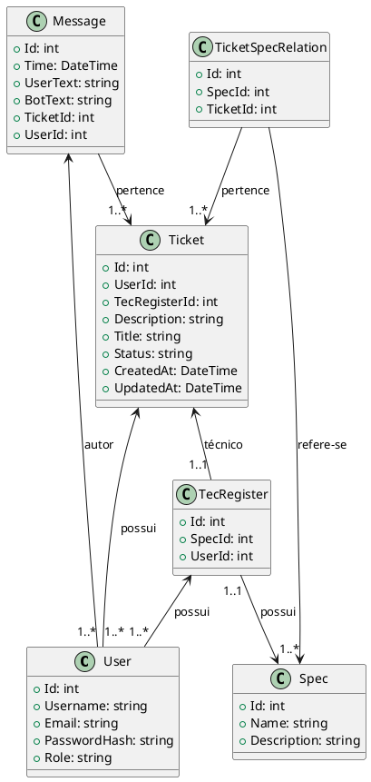

# SuporteAPI

API para gerenciamento de tickets, usuários, técnicos, mensagens e integração com IA.

## Requisitos

- [.NET 9.0 SDK](https://dotnet.microsoft.com/download/dotnet/9.0)
- SQL Server
- Git

## Instalação e Execução

1. **Clone o repositório**
   ```sh
   git clone https://github.com/seu-usuario/API-PIM-4Semestre.git
   cd API-PIM-4Semestre/SuporteAPI/SuporteAPI
   ```
2. **Restaure os pacotes**
   ```sh
   dotnet restore
   ```
3. **Configure o ambiente**
   - Edite `appsettings.Development.json` com sua string de conexão e chaves de API.
4. **Compile o projeto**
   ```sh
   dotnet build
   ```
5. **Execute a API**
   ```sh
   dotnet run
   ```
   Acesse em `http://localhost:5262`.

## Testes de Endpoints

- Utilize o arquivo `SuporteAPI.http`, Postman ou acesse [https://localhost:7096/index.html](https://localhost:7096/index.html) para testar os endpoints.

## Estrutura do Projeto

- **Controllers/**: Endpoints da API
- **Models/**: Modelos de dados
- **Repositorys/**: Repositórios de acesso a dados
- **Service/**: Lógica de negócio
- **Interface/**: Interfaces dos repositórios e serviços
- **DTO/**: Objetos de transferência de dados
- **Utils/**: Utilitários

## Diagramas

### Diagrama de Classes (PlantUML)



### Diagrama de Banco de Dados
Veja o arquivo `diagrama_db.plantuml` para o modelo relacional.

## Documentação

- Acesse a documentação Swagger em `http://localhost:5262` após iniciar o projeto.

---

Em caso de dúvidas, consulte os arquivos de configuração, diagramas ou abra uma issue.